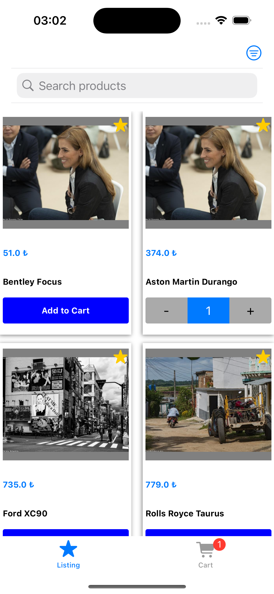
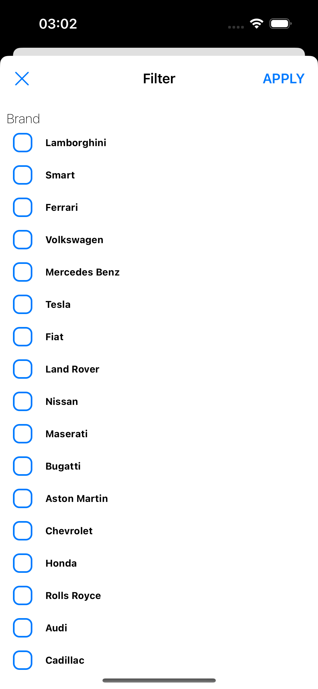
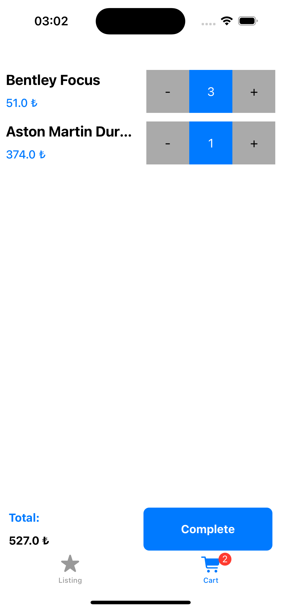
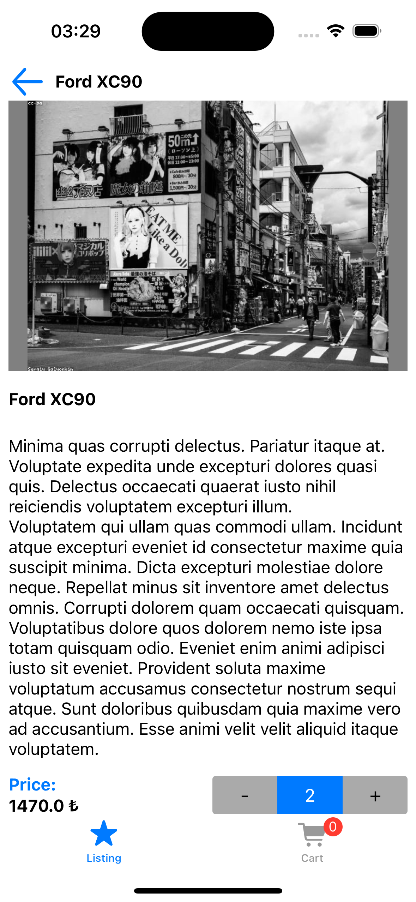

<h1 align="center">
  E Commerce Demo MVVM Project
</h1>

## 🪄 SUMMARY
It is an e-commerce application with some basic rules.

## 🔍 PROJECT NOTES

- Resolution works very well on all devices.
- It's all done with programmaticly. Storyboards are not used.
- Component-based work.

## 🖥 TECHNOLOGIES & FRAMEWORK & PATTERNS

- Swift
- UIKit
- MVVM
- Core Data
- Loading statement
- No data case handling
- Search & Filter products feature
- Unit tests


## Previews 

| List Screen | Filter Screen | Cart Screen | Detail Screen |
| --- | --- | --- | --- |
|  |  |  |  |

## License
```
Copyright (c) 2024 Fahrettin GÖLCÜK
```
